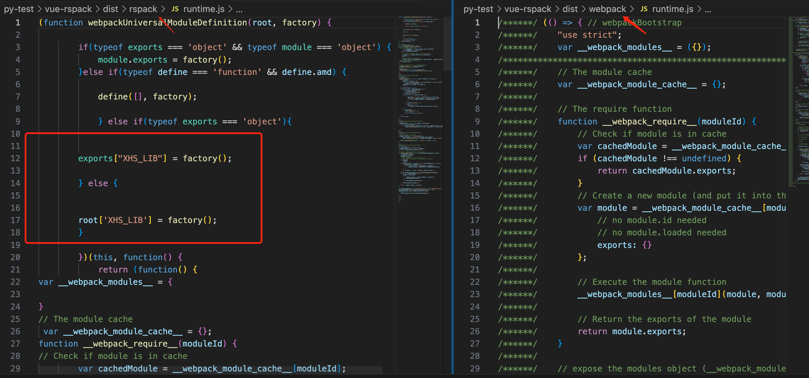

### 准备工作
1. npm i 
2. npm run build

### 需求简述：
1. src/entry-1，src-entry-2 打包成一个umd library  名为： xhs-lib-1
2. src/entry-3 打包成一个umd library 名为： xhs-lib-2
3. 同时抽取runtime 以及chunk

### webpack 与 rspack 对比差异：
1. 搜索 QA-XHS 关键字，可以查看代码实现中rspack 跟 webpack 中不一致的地方，烦请rspack团队帮忙解答一下
2. runtime 差异：查看构建产物，为什么生成的runtime代码中，会包含umd定义，而webpack没有？

